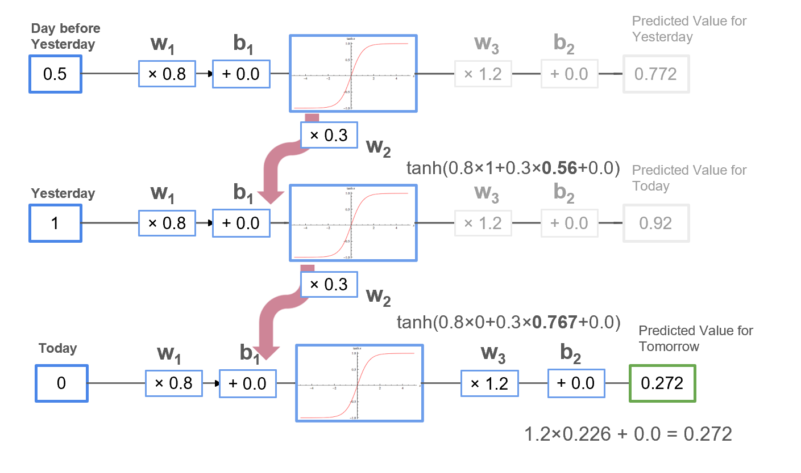
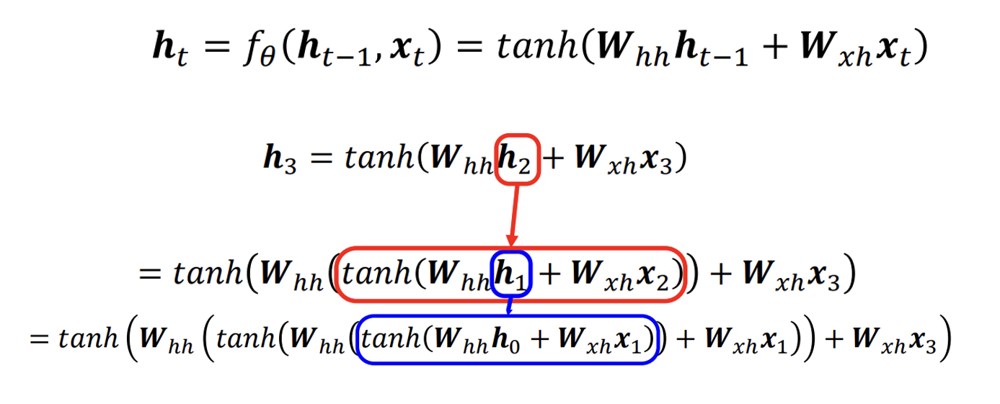

# Statistical Deep Learning Models
**MSc Computational Statistics & Machine Learning · Christ University**

This repository contains teaching material for a MSc Computational Statistics & AI course on Statistical Deep Learning Models.
It includes all the slides I used in class. These follow the arc from Probability to Sequence models.
The course focuses on building strong intuition behind Deep Learning by combining:

* Mathematical foundations
* Visual explanations
* Excel-based simulations
* Practical model understanding through Code

---

## What Makes This Different

I build deep learning models from first principles, using math and simple simulations to show what’s really going on under the hood.
Most deep learning resources jump directly into code. I've tried to make this course different by structuring lectures where:

* Concepts were first explained **mathematically**
* Then visualized using **Excel simulations**
* Finally connected to real deep learning models with Python
  
If you’ve ever felt like you can run a model but not explain it, you're at the right place! :)

<p align="center">
  
</p>

---

## Topics

| # | Topic |
|---|-------|
| 01 | Probability & Statistical Foundations |
| 02 | Neural Networks from First Principles |
| 03 | Forward Pass & Backpropagation |
| 04 | Gradient Descent — Intuition & Math |
| 05 | Recurrent Neural Networks (RNNs) |
| 06 | LSTMs & GRUs |
| 07 | Sequence Modeling |
| 08 | Convolutional Neural Networks |
| 09 | Transformers & Attention Mechanisms |
| 10 | Autoencoders |
| 11 | Restricted Boltzmann Machines |

---
<table>
  <tr>
    <td align="center" width="50%">
      <br/>
      <sub><b>Unfolded RNN across time steps</b></sub>
    </td>
    <td align="center" width="50%">
      <br/>
      <sub><b>Hidden state recursive expansion</b></sub>
    </td>
  </tr>
</table>

## Repository Structure

```
├── lectures/            # Slide decks used in class
├── excel-playgrounds/   # Interactive simulations — start here
└── notebooks/           # From-scratch Python implementations
```
---

## Excel Playgrounds
Before touching Python, I made students build models in Excel to prevent hiding behind abstractions:
A key part of this course is learning through **Excel-based simulations** that include:

* Step-by-step gradient descent
* Neural network forward pass
* RNN unfolding across time steps
* CNN passing pixel values through kernels

These are designed to build intuition before moving to code.

---
## Teaching Context

Used to teach MSc students at the Christ University in a live classroom setting. Materials were designed to be self-contained: a student who missed a lecture should be able to follow the slides, open the corresponding playground, and reconstruct their understanding without needing supplementary resources.

---

## Disclaimer!

This repository is intended for educational purposes.
Some content may be simplified for teaching clarity.

---

## Contact

Feel free to reach out for collaboration, discussions, or feedback.
